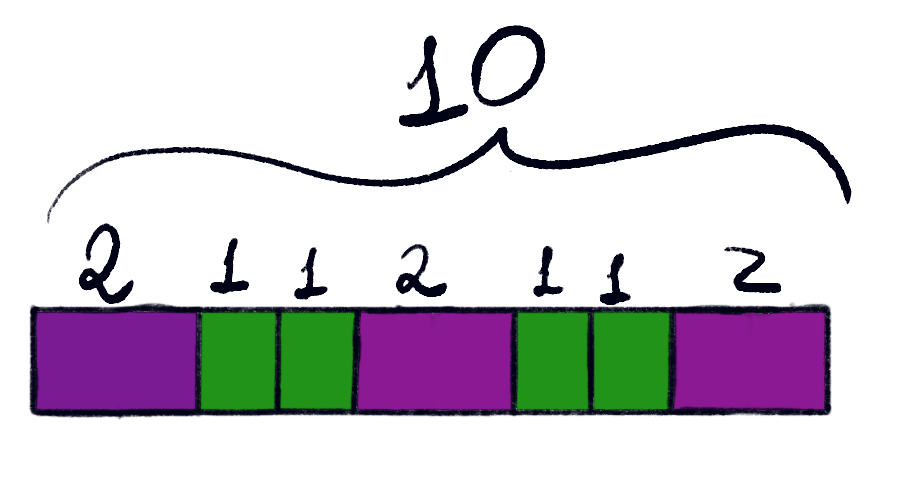

To inaugurate this blog, let's begin with a concise yet insightful topic: the Fibonacci Sequence. 

This post is based in a book called Proofs the Really Count[^1].

[^1]: __Proofs that Really Count__ - Arthur Benjamin and Jennifer Quinn. 

Most people know the Fibonacci sequence $$ (F_n)_{n \geq 0} $$, defined recursively by $$ F_n = F_{n-1} + F_{n-2} $$, with initial conditions \\(F_0 = 0\\) and \\(F_1 = 1\\). This produces the sequence \\((0, 1, 1, 2, 3, 5, \ldots)\\). While the definition may seem arbitrary, the Fibonacci sequence is deeply connected to a classic combinatorial problem: counting the number of ways to tile a one-dimensional board using squares (covering 1 unit) and dominoes (covering 2 units).

Let’s define an _\\(n\\)-board_ as a one-dimensional board of length \\(n\\). For example, the following image illustrates a 10-board tiled with squares and dominoes:

This tiling problem is equivalent to counting the number of sequences of 1's and 2's whose sum is \\(n\\). Each such sequence represents a way to cover the board, where a 1 corresponds to a square and a 2 to a domino.

Let \\(f_n\\) denote the number of sequences of 1's and 2's whose sum is \\(n\\)—that is, the number of ways to tile an \\(n\\)-board with squares and dominoes. For example, let's compute \\(f_3\\). The possible sequences are:

- \\((1, 1, 1)\\)
- \\((1, 2)\\)
- \\((2, 1)\\)

So, \\(f_3 = 3\\). Now consider \\(f_4\\). The possible sequences are:

- \\((1, 1, 1, 1)\\)
- \\((1, 1, 2)\\)
- \\((1, 2, 1)\\)
- \\((2, 1, 1)\\)
- \\((2, 2)\\)

Thus, \\(f_4 = 5\\). Notice that these numbers match the Fibonacci sequence, but shifted by one index: \\(f_3 = F_4\\) and \\(f_4 = F_5\\). This leads to a fundamental result:

> **Theorem 1 (Fibonacci Tiling Interpretation).**
>
> The number of ways to tile an \\(n\\)-board using squares (of length 1) and dominoes (of length 2), denoted by \\(f_n\\), is exactly \\(F_{n+1}\\), the \\((n+1)\\)th Fibonacci number.

The proof is straightforward: we just need to show that \\(f_n\\) satisfies the same recurrence as the Fibonacci numbers. Define \\(f_0 = 1\\) (the empty tiling for the 0-board) and \\(f_{-1} = 0\\) (no way to tile a -1-board).

We see that \\(f_1 = 1\\) and \\(f_2 = 2\\). For \\(n > 2\\), consider a sequence summing to \\(n\\). It starts with either 1 or 2. If it starts with 1, the rest sums to \\(n-1\\), giving \\(f_{n-1}\\) possibilities. If it starts with 2, the rest sums to \\(n-2\\), giving \\(f_{n-2}\\) possibilities. Thus,

$$
f_n = f_{n-1} + f_{n-2}
$$

which matches the Fibonacci recurrence. Since the initial conditions are the same but shifted by one index, we have

$$
f_n = F_{n+1}
$$

Neat, right? This combinatorial perspective not only provides an intuitive understanding of the Fibonacci sequence, but also offers elegant proofs for many identities that would otherwise require more involved algebraic manipulations.

